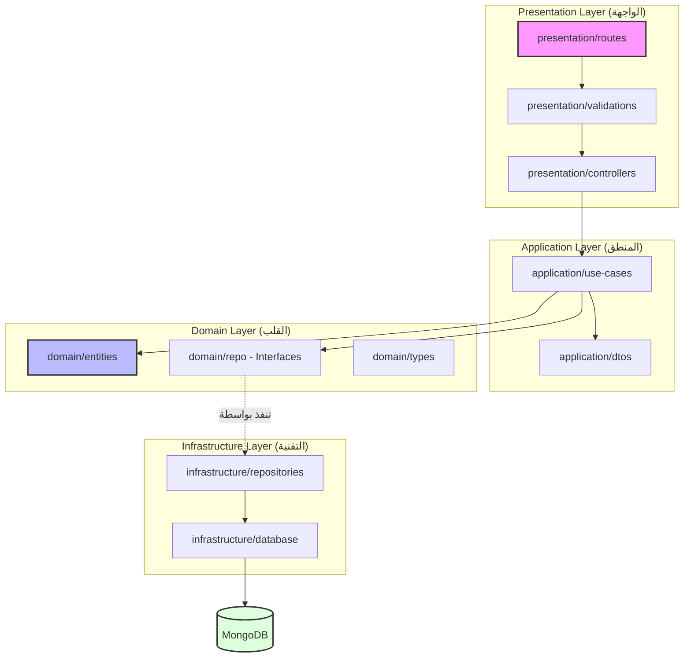

# دليل هيكلة المشروع (Clean Architecture Guide) 🚀

هذا الدليل يشرح كيفية تدفق البيانات وتواصل المجلدات في النظام الجديد لمشروع **mini-zone-api**.

## 🏗️ الهيكل العام للمجلدات (Folder Structure)

```text
src/
├── domain/            # (القلب) يحتوي على قواعد العمل الأساسية
│   ├── entities/      # كائنات البيانات النظيفة
│   ├── repo/          # الاتفاقيات (Interfaces)
│   └── types/         # الأنواع الخاصة بالـ Domain
│
├── application/       # (المايسترو) ينظم العمليات
│   ├── use-cases/     # كل ملف يمثل عملية واحدة (مثلاً: CreateBrand)
│   └── dtos/          # أشكال البيانات المدخلة والمخرجة للـ Use Case
│
├── infrastructure/    # (التقنية) تفاصيل التنفيذ وقاعدة البيانات
│   ├── database/      # موديلات Mongoose والاتصال بقاعدة البيانات
│   └── repositories/  # التنفيذ الفعلي للـ Repositories
│
└── presentation/      # (البوابة) التواصل مع العالم الخارجي
    ├── controllers/   # معالجة الطلبات (Requests) والردود (Responses)
    ├── routes/        # تعريف المسارات (Endpoints)
    └── validations/   # التحقق من البيانات (Zod Schemas)
```

## 🗺️ خريطة تواصل المجلدات (Folder Interaction Map)



## 🧭 رحلة الطلب (Step-by-Step Flow)

1.  **المسار (Route)**: يستقبل الطلب من المستخدم.
2.  **التحقق (Validation)**: يتم التأكد من صحة البيانات (Zod) قبل أي شيء.
3.  **المتحكم (Controller)**: يستلم البيانات "النظيفة" ويسلمها للـ Use Case المناسب.
4.  **حالة الاستخدام (Use Case)**: تنفذ المنطق (Logic). تطلب من الـ Repository Interface البحث أو الحفظ.
5.  **المستودع (Repository Impl)**: ينفذ الأمر الفعلي على قاعدة البيانات (MongoDB) باستخدام الـ Model.
6.  **الكيان (Entity)**: تعود البيانات من قاعدة البيانات ويتم تحويلها لـ Entity "نظيف" يعود في النهاية للمستخدم.

## ⚖️ القواعد الذهبية
*   **الاتجاه للداخل فقط**: المجلدات الخارجية تعرف المجلدات الداخلية، لكن العكس غير صحيح. (الـ Domain لا يعرف أي شيء عن الـ Infrastructure).
*   **استقلالية المنطق**: الـ Use Case لا يهتم إذا كنت تستخدم MongoDB أو SQL، هو فقط ينفذ المنطق.
*   **ملف واحد لكل عملية**: كل Use Case يجب أن يكون في ملف منفصل لسهولة الصيانة والاختبار.
